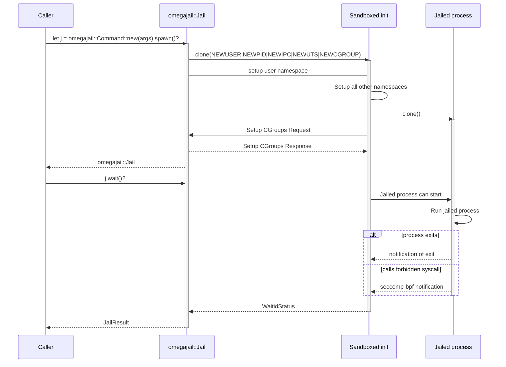

# omegajail

The omegaUp sandbox. Creates a userspace container with seccomp-bpf syscall
filtering in which the untrusted code is run.



## Example

```ignore
let args = omegajail::Args{
  // ...
};
let result = omegajail::jail::Command::new(args).spawn()?.wait()?;
println!("{:?}", result);
```

## ATT&CK BERT Usage

ATT&CK BERT is a cybersecurity domain-specific language model based on sentence-transformers. ATT&CK BERT maps sentences representing attack actions to a semantically meaningful embedding vector. Embedding vectors of sentences with similar meanings have a high cosine similarity.

### Installation

Using this model becomes easy when you have sentence-transformers installed:

```sh
pip install -U sentence-transformers
```

### Example Code

```python
from sentence_transformers import SentenceTransformer
sentences = ["Attacker takes a screenshot", "Attacker captures the screen"]

model = SentenceTransformer('basel/ATTACK-BERT')
embeddings = model.encode(sentences)

from sklearn.metrics.pairwise import cosine_similarity
print(cosine_similarity([embeddings[0]], [embeddings[1]]))
```

To use ATT&CK BERT to map text to ATT&CK techniques, check our tool SMET: https://github.com/basel-a/SMET
